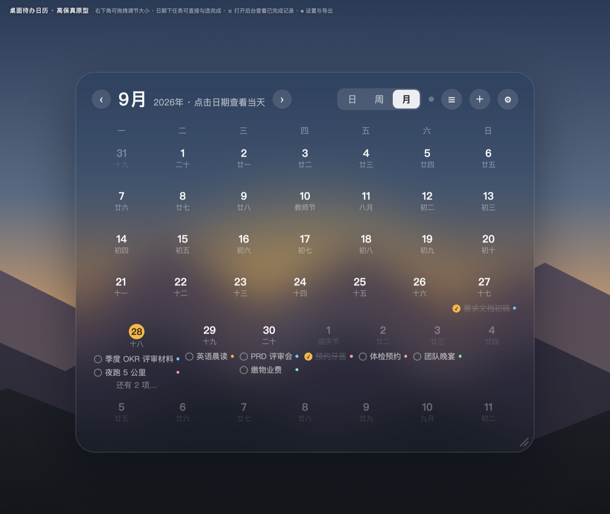
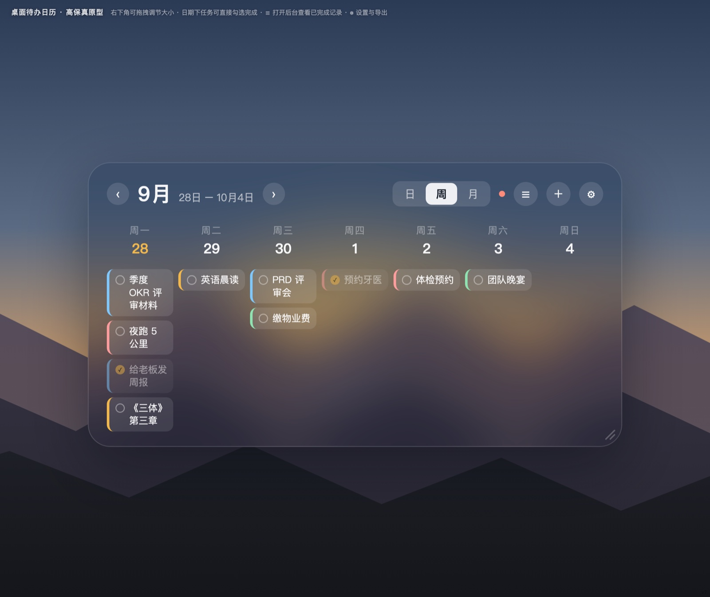
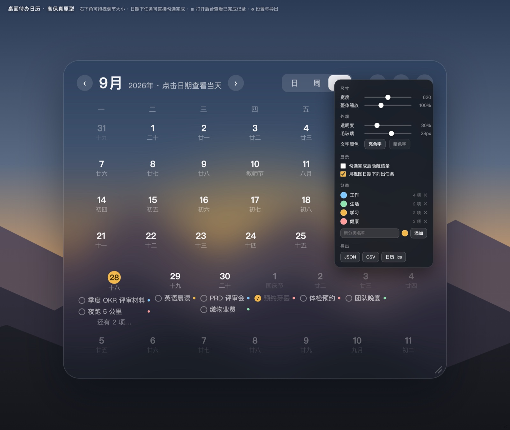
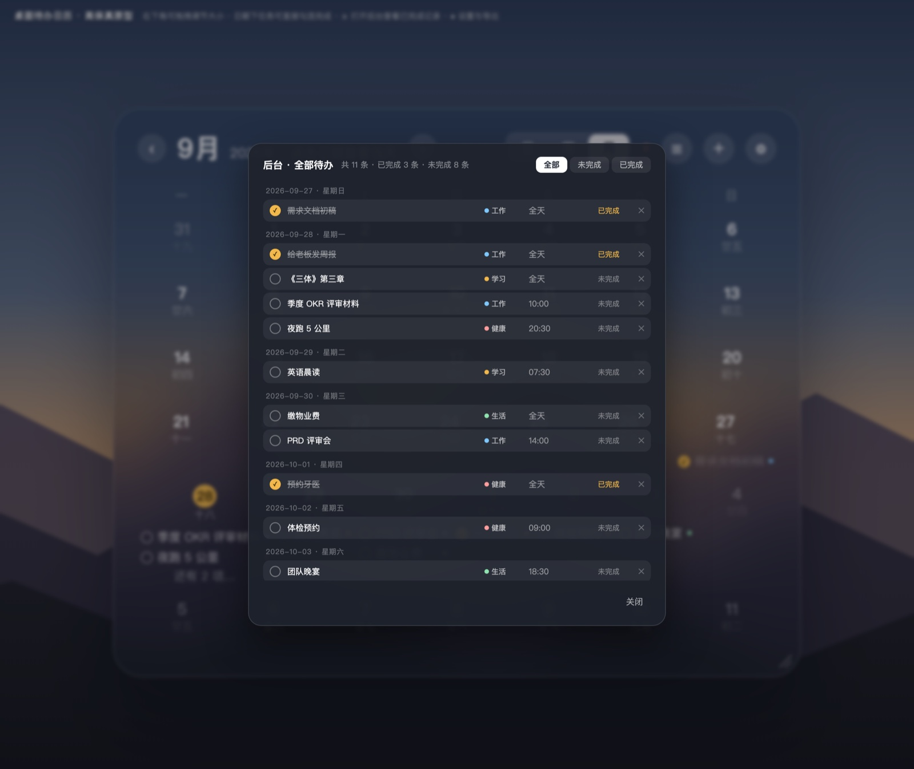

# DeskCal

把待办日历贴在 macOS 桌面上的小组件。它在壁纸之上、普通应用窗口之下，安静地待在那儿，不挡工作；露出来的区域可以直接点击勾选。

原生外壳用 Swift 的 `NSPanel` + `WKWebView`，界面是单文件 `index.html`。所以视觉和交互全在一个网页里，想改什么改什么。

数据存在本机 `localStorage`，不需要后端，不联网，没有账号。开箱即用。



## 特性

1. **月 / 周 / 日三种视图**，翻页切换，点日期直接下钻到当天。
2. **点圆圈或整行都能勾选完成**，命中区域做得大，不用瞄准。
3. **农历与节日**，走系统 `Intl` 的 Chinese calendar，节气节日自动显示。
4. **分类可自建**，四个默认分类带颜色，改名、改色、增删都行。
5. **外观可调**，宽度、整体缩放、背景透明度、毛玻璃强度、文字明暗。
6. **数据可带走**，导出 JSON、CSV，或者日历 `.ics` 直接导入系统日历。
7. **完全本地**，断网全功能可用，不产生任何网络请求。
8. **不占 Dock**，以 `.accessory` 模式运行，只在菜单栏留一个日历图标。

## 快速开始

需要 macOS 12 或更高，以及 Xcode 命令行工具。

```bash
xcode-select --install     # 只装过一次就不用再装
cd DeskCalApp
bash build_app.sh
open DeskCal.app
```

首次打开，主屏右下角的桌面上会出现一个磨砂圆角卡片。

自己编译的 App 没有 Apple 签名，如果双击提示「已损坏」或没有反应，执行下面这行去掉隔离标记再打开：

```bash
xattr -d com.apple.quarantine DeskCal.app
```

## 使用

| 操作 | 说明 |
|---|---|
| 切视图 | 顶部的「日 / 周 / 月」三段按钮 |
| 翻页 | 标题两侧的 ‹ › 按钮，按当前视图翻一天、一周或一月 |
| 勾选完成 | 点任务左侧的圆圈，或者点整行 |
| 新增待办 | 右侧的 ＋ 按钮 |
| 全部待办 | 右侧的 ☰ 按钮，可按全部 / 未完成 / 已完成筛选 |
| 设置 | 右侧的 ⚙ 按钮，调尺寸、外观、显示、分类、导出 |
| 移动位置 | 按住卡片主体拖动 |
| 改大小 | 拖右下角的斜纹把手 |
| 退出 | 菜单栏的日历图标，点退出 |

### 周视图



### 设置

尺寸、透明度、毛玻璃、文字明暗都是即时生效的，拖完即所见。



### 全部待办



## 可选：跨机器同步

默认不做，数据就在本机。如果你有多台 Mac 想让它们在同一个清单上工作，`sync-server/` 里有一套 FastAPI + SQLite 的同步后端，两个接口 `GET /state` 与 `PUT /state`，按条目 `updatedAt` 合并。

**这部分请务必读完再部署。** 它没有用户体系，做错了等于把待办清单挂到公网上让人随便读写。要点三条：

1. **在反向代理层按来源放行。** nginx 给接口路径加白名单，只放行 `127.0.0.1` 和你自己的出口 IP，其余 `deny all`。这是唯一真正有效的一层。
2. **或者干脆不对外暴露。** 后端只监听 `127.0.0.1`，需要同步时走 SSH 隧道把端口转到本机。出口 IP 不固定就用这种。
3. **不要只加一个 token 就发到公网。** 组件要能同步就得从服务器加载页面，而那个页面是公开的，写在页面里的 token 谁看源码都能拿到，只能挡住随手扫描。

细节见 [sync-server/README.md](sync-server/README.md)。

## 常见问题

**界面能显示，但点了没反应。**
外壳的 `panel.becomesKeyOnlyIfNeeded` 必须是 `false`。设成 `true` 时窗口不会成为 key window，WKWebView 就不派发 JS 的 `click` 事件，界面看起来完全正常，只是点不动。

**界面是黑的，只有一块深色背景。**
用 container 包住 webview 之后忘了 `container.addSubview(webView)`。属性赋值不会把视图加进层级。

**卡片四个角是黑色方块。**
container 上开了 `masksToBounds = true`。圆角加裁剪会把 webview 渲染成纯黑，保持默认的 `false` 就行。

**改了 `index.html` 但界面没变。**
WKWebView 缓存很激进。外壳已经用 `nonPersistent()` 数据仓加 `_ts` 时间戳破缓存，重新跑一遍 `bash build_app.sh` 再打开即可。菜单里的「刷新组件」也能强制重载。

**卡片被窗口挡住的部分点不到。**
这是设计如此。组件在桌面层，和桌面图标同一层，被普通窗口盖住的区域不接收点击。空出桌面就能点。

**能直接下载一个 `.app` 吗？**
不能。没有 Apple 开发者账号就无法公证，未公证的 App 分发出去别人打不开。所以这里是源码加一键构建脚本，各自本地编译。

## 目录结构

```
DeskCal/
├── index.html                  # 组件界面，全部视觉与交互都在这里
├── DeskCalApp/
│   ├── App.swift               # 原生外壳：NSPanel + WKWebView
│   └── build_app.sh            # 编译 + 打包 + 自签
├── sync-server/                # 可选：跨机器同步后端
│   ├── app.py                  # FastAPI + SQLite
│   ├── deskcal.service         # systemd 托管配置
│   └── README.md
├── docs/                       # 截图与截图生成脚本
└── LICENSE
```

界面截图由 `docs/make-screenshots.py` 生成，它用无头 Chrome 真实渲染 `index.html`，不是手绘效果图。改了界面想更新截图：

```bash
python3 docs/make-screenshots.py
```

## 许可

[PolyForm Noncommercial License 1.0.0](https://polyformproject.org/licenses/noncommercial/1.0.0)。

个人使用、学习、研究、修改、分享都可以。不得用于商业目的，不得上架应用商店，不得对外售卖，不得用于交付给客户的商业项目。要商用请联系作者。
